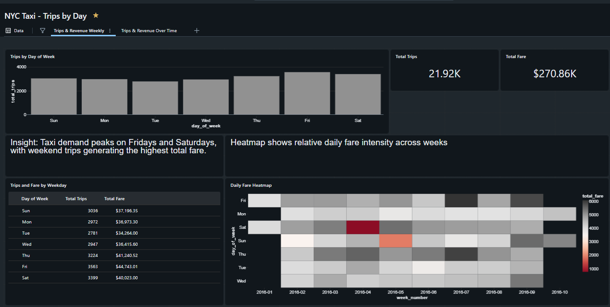

# Databricks Analytics Dashboard (Sample Data)

## Overview
This project demonstrates analytical exploration, aggregation, and dashboard visualization
using public sample data in a Databricks environment. It was created as a skills‑development
exercise to practice structuring queries, identifying trends, and presenting results clearly.

No proprietary, employer, or internal data is included.

---

## Data
The dataset used in this project is publicly available sample data (NYC Taxi trips),
commonly used for analytics and visualization practice.

---

## Approach
The project focuses on:
- Aggregating data across time dimensions
- Identifying high‑level usage and trend patterns
- Designing clear KPI‑style summaries
- Structuring queries and outputs for readability

The emphasis is on clarity and analytical reasoning rather than optimization or prediction.

---

## Sample Dashboard

---

## Tools Used
- Databricks (SQL dashboards)
- SQL for aggregation and basic analysis

---

## Notes
This repository is intended for demonstration purposes only and reflects how I approach
analytics problem‑solving, documentation, and presentation using non‑proprietary data.
